# 🤖 Discord AI Content Router & Multi-Agent Assistant

An automated **n8n + Docker** multi-agent pipeline that monitors a Discord intake channel, classifies incoming content across social media and the web (Instagram Reels, YouTube videos, GitHub repositories, Web articles, workouts, recipes, anime, and movies), extracts multimodal data (including **paginated Instagram comments, video audio transcription, and on-screen OCR**), and posts clean, formatted recommendation cards to dedicated Discord channels.

---

## 🌟 Key Features

### 🧠 6 Intelligent Specialty Agents
* **🍳 ChefGPT (`#recipe`):** Ingredients, prep/cook times, and numbered step-by-step instructions.
* **💻 CodeGPT (`#projects`):** Tech tools, open-source libraries, architecture breakdowns, and **verified GitHub repository links**.
* **🏋️ FitGPT (`#workout`):** Target muscle groups, exercise splits, sets/reps, and form cues.
* **🎌 AnimeGPT (`#anime-manhua`):** Japanese Anime, Korean Manhwa / Webtoons, Chinese Manhua / Donghua, Manga, and Light Novels with **exact canonical IMDb links**.
* **🎬 WatchlistGPT (`#movie-tv`):** Live-action Movies, TV Series, and documentaries with spoiler-free synopses, streaming platforms, and **exact canonical IMDb links**.
* **📌 OmniGPT (`#others`):** General articles, news, interesting tools, productivity workflows, and lifestyle content.

---

### 🌐 Universal Multimodal Scraping Engine (`universal_scraper.py`)
* **100% Free & Self-Hosted:** Replaces paid scraping APIs using `gallery-dl`, `yt-dlp`, and `ffmpeg`.
* **Multi-Page Instagram Comments (GraphQL):** Extracts up to 100+ comments with pinned/creator priority to capture titles and community recommendations.
* **Audio Speech-to-Text Transcription:** Downloads `.mp4` audio streams and transcribes spoken creator dialogue into text for the LLM.
* **On-Screen Keyframe OCR:** Extracts on-screen code snippets, tool names, and text overlays using `Tesseract OCR`.
* **Verified GitHub Discovery:** Cleans creator engagement hooks (`"Comment WORKSTATION"`) and resolves the exact official repository via DOM search.
* **Canonical IMDb Resolution:** Normalizes Unicode stylized fonts (`• 𝐓𝐢𝐭𝐥𝐞:` $\rightarrow$ `Title:`) and resolves canonical IMDb title IDs (`tt...`).

---

### ⚡ Automated Subflows & System Reliability
* **🗞️ Daily 11:00 PM IST Digest:** Automated schedule trigger (`30 17 * * *` UTC) aggregating all curated items from the last 24 hours into a clickable recap posted in `#general`.
* **🚨 Automated `#error-log` Alerts:** Dedicated `Error Trigger` node capturing workflow failures and routing formatted error reports to `#error-log`.
* **📄 Multi-Message Paragraph Chunking:** Cleanly splits long content ($\ge 1,850$ characters) across sequential messages (`Part 1/2`, `Part 2/2`) without exceeding Discord's 2,000-character limit.
* **🤖 Dual LLM Backend:** Seamlessly switch between **OpenRouter** cloud models (`gpt-4o-mini`, `gpt-oss-20b`, `claude-3.5-sonnet`) and **LM Studio** local models via OpenAI-compatible endpoints (`http://host.docker.internal:1234/v1`).

---

## 📁 Repository Structure

```text
.
├── Dockerfile                             # Multi-stage image: n8n + Python 3 + yt-dlp + gallery-dl + ffmpeg + Tesseract OCR
├── docker-compose.yml                     # Container orchestration (n8n, ngrok, discord-bot)
├── universal_scraper.py                   # Multimodal scraper (audio transcription, OCR, IMDb & GitHub resolver)
├── generate_daily_digest.py               # Automated 24h Discord channel aggregation script
├── config.json                            # gallery-dl Instagram session configuration
├── cookies.txt                            # Netscape-formatted Instagram cookies (for auth bypass)
├── Discord AI Multi-Agent Router.json     # Complete export of all n8n workflow nodes and agent chains
├── discord-bot/                           # Real-time Discord gateway listener bot
│   ├── bot.js
│   ├── package.json
│   └── Dockerfile
└── README.md
```

---

## 🚀 Quick Start & Setup

### 1. Prerequisites
* [Docker Desktop](https://www.docker.com/products/docker-desktop/) installed and running.
* An active Discord Bot Token ([Discord Developer Portal](https://discord.com/developers/applications)).
* A free [ngrok](https://ngrok.com/) account and authtoken.
* An [OpenRouter](https://openrouter.ai/) API key or local [LM Studio](https://lmstudio.ai/) server.

---

### 2. Configure Environment Variables (`.env`)

Create a `.env` file in the root directory:

```bash
# Discord Configuration
DISCORD_BOT_TOKEN=your_discord_bot_token_here
DISCORD_CHANNEL_ID=your_intake_channel_id_here

# ngrok Configuration
NGROK_AUTHTOKEN=your_ngrok_token_here
```

---

### 3. Add Instagram Cookies (For Instagram Extraction)

1. Log into Instagram in your web browser.
2. Export your cookies in **Netscape format** using a browser extension (e.g. *Get cookies.txt LOCALLY* or *Cookie-Editor*).
3. Paste the exported cookie text into `cookies.txt` in the root folder.

---

### 4. Build and Start the Containers

```bash
docker compose up -d --build
```

Verify that all containers are healthy:
```bash
docker compose ps
```

---

### 5. Import and Activate the Workflow in n8n

1. Open your n8n web editor at `https://your-ngrok-domain.ngrok-free.dev` (or `http://localhost:5678`).
2. Go to **Credentials** and add:
   * **OpenRouter account:** Your OpenRouter API Key (or local LM Studio credentials).
   * **Discord Bot account:** Your Discord Bot Token.
3. Import the workflow:
   * Click **Workflows $\rightarrow$ Import from File**, and select `Discord AI Multi-Agent Router.json`.
   * *(Or via CLI)*:
     ```bash
     docker cp "Discord AI Multi-Agent Router.json" discord-n8n-n8n-1:/tmp/workflow.json
     docker exec -u node discord-n8n-n8n-1 n8n import:workflow --input=/tmp/workflow.json
     ```
4. Set your destination channel IDs in the Discord output nodes (`#recipe`, `#projects`, `#workout`, `#anime-manhua`, `#movie-tv`, `#others`, `#general`, `#error-log`).
5. Toggle the workflow status to **Active** (Published).

---

## 🛠️ Architecture Flow

```mermaid
flowchart TD
    A[Discord Intake Message / Webhook] --> B[Extract URLs & Media]
    B --> C{URL Type?}
    C -- Social Video / Webpage --> D[universal_scraper.py<br/>yt-dlp + gallery-dl + ffmpeg + Tesseract OCR]
    D --> E[Parsed Transcript, Comments, OCR, IMDb & GitHub URLs]
    C -- Text / Direct Post --> F[AI Router Classification]
    E --> F
    
    F --> G{Router Switch}
    G -- recipe --> H1[ChefGPT Agent] --> P1[#recipe]
    G -- project --> H2[CodeGPT Agent] --> P2[#projects]
    G -- workout --> H3[FitGPT Agent] --> P3[#workout]
    G -- anime --> H4[AnimeGPT Agent] --> P4[#anime-manhua]
    G -- media --> H5[WatchlistGPT Agent] --> P5[#movie-tv]
    G -- others --> H6[OmniGPT Agent] --> P6[#others]

    subgraph Background Subflows
        T1[Daily 11 PM IST Trigger] --> D1[generate_daily_digest.py] --> D2[Post Digest to #general]
        E1[Error Trigger Node] --> E2[Format Error Alert] --> E3[Post to #error-log]
    end
```



---

## 🔧 Useful Commands

* **View live n8n container logs:**
  ```bash
  docker logs -f discord-n8n-n8n-1
  ```
* **Test universal scraper directly:**
  ```bash
  docker exec -u node discord-n8n-n8n-1 python3 /usr/local/bin/universal_scraper.py "https://www.instagram.com/reel/YOUR_REEL_ID/"
  ```
* **Test Daily Digest generator directly:**
  ```bash
  docker exec -u node discord-n8n-n8n-1 python3 /usr/local/bin/generate_daily_digest.py
  ```
* **Restart n8n service:**
  ```bash
  docker compose restart n8n
  ```

---

## 🛡️ Troubleshooting

| Issue | Cause | Fix |
| :--- | :--- | :--- |
| `AbortExtraction: HTTP redirect to login page` | Expired Instagram cookies. | Refresh and paste updated cookies into `cookies.txt`. |
| `Rate limit exceeded on GitHub lookup` | Unauthenticated GitHub API rate limits. | Handled automatically with fallback to BeautifulSoup DOM search. |
| `Unrecognized node type: executeCommand` | Execute Command node restricted in n8n default config. | Ensure `NODES_EXCLUDE=[]` and `N8N_ENABLE_UNSAFE_CORE_NODES=true` are set in `docker-compose.yml`. |
| `Workflow execution error` | Unexpected runtime exception or upstream API issue. | Handled automatically by the `Error Trigger` node and routed to `#error-log`. |

---

## 🔒 Security & Privacy

* **Zero Hardcoded Secrets:** All tokens and credentials are read strictly from environment variables or secure n8n credential storage.
* **Push Protection Compliant:** No private auth keys, webhook secrets, or token strings are committed to version control.
