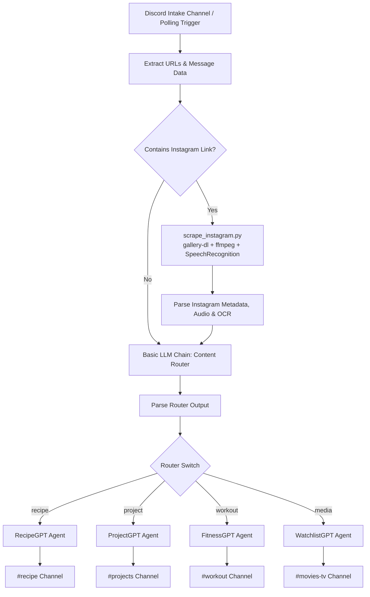

# 🤖 Discord AI Content Router & Multi-Agent Assistant

An automated **n8n + Docker** multi-agent pipeline that monitors a Discord intake channel, classifies shared content (Instagram Reels, YouTube videos, GitHub repositories, workout plans, recipes, and movies), extracts multimedia data (including **full Instagram captions, video audio transcription, and on-screen OCR**), and posts clean, formatted summary cards to dedicated Discord channels.

---

## 🌟 Key Features

* **🧠 Intelligent AI Content Router:** Automatically classifies incoming Discord messages, links, and attachments into 4 specialized categories:
  * **🍳 RecipeGPT:** Extracts ingredients, prep/cook time, and numbered steps $\rightarrow$ Posts to `#recipe`
  * **💻 ProjectGPT:** Summarizes tech tools, GitHub repos, and coding tutorials $\rightarrow$ Posts to `#projects`
  * **🏋️ FitnessGPT:** Organizes gym workouts, exercises, sets/reps, and form cues $\rightarrow$ Posts to `#workout`
  * **🎬 WatchlistGPT:** Formats movie and TV show recommendations with spoiler-free synopses $\rightarrow$ Posts to `#movies-tv`
* **📸 Complete Instagram Scraper & Transcriber:**
  * **100% Free & Self-Hosted:** Replaces paid third-party APIs (like Apify) using `gallery-dl`, `yt-dlp`, and `ffmpeg`.
  * **Caption & Metadata Extraction:** Pulls full post descriptions, creator tags, and engagement counts.
  * **Spoken Audio Transcription:** Downloads the `.mp4` video stream, extracts the audio track with `ffmpeg`, and transcribes spoken creator dialogue into text for the LLM.
  * **On-Screen Video OCR:** Analyzes keyframe frames using `Tesseract OCR` to extract on-screen code snippets, tool names, and text overlays.
* **⚡ High-Signal, Concise Discord Cards:** Every agent outputs concise, scannable cards strictly bounded under Discord's 2,000-character limit.
* **🌐 Integrated ngrok Tunnel:** Provides a fixed public webhook and editor URL for self-hosted n8n.

---

## 📁 Repository Structure

```text
.
├── Dockerfile                             # Multi-stage image: n8n + Python 3 + gallery-dl + ffmpeg + OCR
├── docker-compose.yml                     # Container definitions for n8n, ngrok, and discord-bot
├── scrape_instagram.py                    # Audio transcription, OCR, and metadata extraction engine
├── config.json                            # gallery-dl Instagram session configuration
├── cookies.txt                            # Netscape-formatted Instagram cookies (for auth bypass)
├── Discord AI Router + Recipe Agent.json  # Complete n8n workflow export
├── discord-bot/                           # Node.js Discord gateway bot
│   ├── bot.js
│   ├── package.json
│   └── Dockerfile
├── start-n8n-ngrok.command               # 1-click launch script for macOS
└── README.md
```

---

## 🚀 Quick Start & Installation

### 1. Prerequisites
* [Docker Desktop](https://www.docker.com/products/docker-desktop/) installed and running.
* An active Discord Bot Token ([Discord Developer Portal](https://discord.com/developers/applications)).
* A free [ngrok](https://ngrok.com/) account and authtoken.
* An [OpenRouter](https://openrouter.ai/) API key for AI inference.

---

### 2. Configure Environment Variables

Edit `docker-compose.yml` to set your credentials and channel IDs:

```yaml
services:
  n8n:
    build: .
    restart: always
    ports:
      - "5678:5678"
    environment:
      - N8N_PROTOCOL=https
      - N8N_HOST=your-ngrok-domain.ngrok-free.dev
      - WEBHOOK_URL=https://your-ngrok-domain.ngrok-free.dev/
      - N8N_EDITOR_BASE_URL=https://your-ngrok-domain.ngrok-free.dev/
      - GENERIC_TIMEZONE=Asia/Kolkata
      - NODES_EXCLUDE=[]
      - N8N_ENABLE_UNSAFE_CORE_NODES=true
      - N8N_BLOCK_ENV_ACCESS_IN_NODE=false
      - N8N_PROXY_HOPS=1
    volumes:
      - n8n_data:/home/node/.n8n
      - ./config.json:/home/node/.config/gallery-dl/config.json:ro
      - ./cookies.txt:/home/node/.config/gallery-dl/cookies.txt:ro

  ngrok:
    image: ngrok/ngrok:latest
    restart: always
    command:
      - "http"
      - "n8n:5678"
      - "--url=your-ngrok-domain.ngrok-free.dev"
    environment:
      - NGROK_AUTHTOKEN=your_ngrok_token_here

  discord-bot:
    build: ./discord-bot
    restart: always
    environment:
      - DISCORD_BOT_TOKEN=your_discord_bot_token_here
      - DISCORD_CHANNEL_ID=your_intake_channel_id_here
      - N8N_WEBHOOK_URL=http://n8n:5678/webhook/discord-intake
```

---

### 3. Add Instagram Cookies (Bypass Login Wall)

Instagram requires an authenticated session to access post data and video streams.

1. Log into Instagram in your web browser (a secondary/burner account is recommended).
2. Export your cookies in **Netscape format** using a browser extension like:
   * **Chrome / Brave:** [Get cookies.txt LOCALLY](https://chromewebstore.google.com/detail/get-cookiestxt-locally/cclelndahbckbenkjhflpdbgdldlbecc) or **Cookie-Editor**
   * **Firefox:** Export Cookies
3. Paste the exported cookie text into `cookies.txt` in the root of this folder.

---

### 4. Build and Start the Containers

Run the following command to build the custom n8n container and start all services:

```bash
docker compose up -d --build
```

To verify the status of running containers:

```bash
docker compose ps
```

---

### 5. Import and Activate the n8n Workflow

1. Open your n8n web editor at `https://your-ngrok-domain.ngrok-free.dev` (or `http://localhost:5678`).
2. Go to **Credentials** and configure:
   * **OpenRouter account:** Add your OpenRouter API Key.
   * **Discord Bot account:** Add your Discord Bot Token.
3. Import the workflow file:
   * In n8n, click **Workflows $\rightarrow$ Import from File**, and select `Discord AI Router + Recipe Agent.json`.
   * *(Alternatively, via CLI)*:
     ```bash
     docker cp "Discord AI Router + Recipe Agent.json" discord-n8n-n8n-1:/tmp/workflow.json
     docker exec -u node discord-n8n-n8n-1 n8n import:workflow --input=/tmp/workflow.json
     ```
4. Update the **Discord Channel IDs** in each output node (`Create Recipe Post`, `Create Project Post`, `Create Workout Post`, `Create Media Post`) to match your server's channels.
5. Toggle the workflow status to **Active** (Published).

---

## 🛠️ Architecture & Workflow Diagram



---

## 🔧 Useful Commands

* **View live n8n logs:**
  ```bash
  docker logs -f discord-n8n-n8n-1
  ```
* **Test Instagram Scraping & Audio Transcription directly:**
  ```bash
  docker exec -u node discord-n8n-n8n-1 python3 /usr/local/bin/scrape_instagram.py "https://www.instagram.com/reel/YOUR_REEL_ID/"
  ```
* **Restart n8n container:**
  ```bash
  docker compose restart n8n
  ```
* **Stop all containers:**
  ```bash
  docker compose down
  ```

---

## 🛡️ Troubleshooting

| Issue | Cause | Fix |
| :--- | :--- | :--- |
| `AbortExtraction: HTTP redirect to login page` | Missing or expired Instagram cookies. | Refresh and paste updated cookies into `cookies.txt`. |
| `Invalid Form Body` on Discord post | Output message exceeded 2,000 characters. | Handled automatically by the built-in `finalContent` 1,850-character limiter. |
| `Unrecognized node type: executeCommand` | Execute Command node disabled by default in n8n v2+. | Ensure `NODES_EXCLUDE=[]` and `N8N_ENABLE_UNSAFE_CORE_NODES=true` are set in `docker-compose.yml`. |
